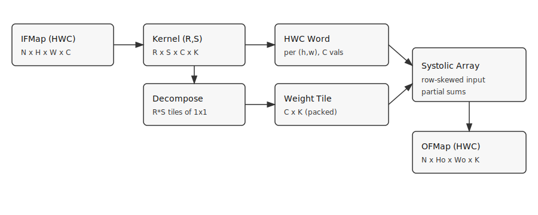

## Flow

- Systolic array size fixed at **32×32** (Atalla). **Mapping: K-rows / C_out-cols** (inference-optimized).
- IFMap HWC → channel-first im2col → GEMM (M,K)@(K,N). **K-tiling** (rows) and **N-tiling** (cols) in 32×32 blocks; **output spatial tiling** (M streamed in tiles). **Padding** (pad=0,1,2,…) verified vs direct conv.
- Streamlit: systolic array movement (weight tile, input row, psum row with colorbars + short legend) and **psum writeback** (which OFMap cell and channel slice get accumulated).

## Run
CLI:
```
python im2col.py
```

Streamlit GUI:
```
streamlit run streamlit_app.py
```

<!--
For very large layers (e.g. 224×224, C=128), the app skips storing the unfolded matrix to avoid exceeding the browser message limit (~200 MB). Use smaller H,W,C for the Unfolded tab or run utilization sweeps instead.

Utilization sweeps (separate program per mapping):

- **K-rows / C_out-cols** (inference): `python sweep_utilization.py` → `utilization_sweep.png` (util vs C_out, C_in, N, kernel size, ifmap size, C_in×C_out heatmap).
- **Batch-parallel** (cols=N): `python sweep_utilization_batch_parallel.py` → `utilization_sweep_batch_parallel.png` (util vs N, C_in, C_out, kernel size, ifmap size, N×C_in heatmap). Optimal inputs differ (e.g. need N≥32 for full column fill).
- Other mappings (e.g. channel-parallel multiple filters) can be added with their own util formula and sweep script.
-->
